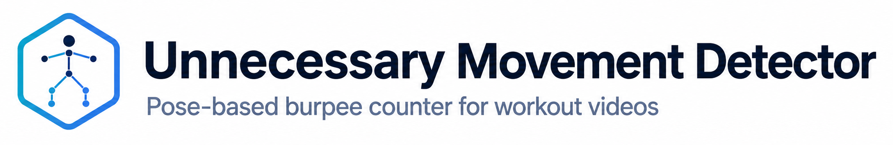
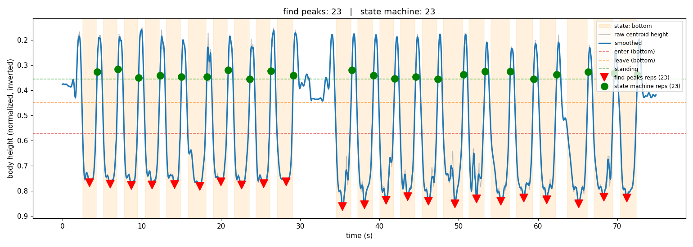

# Unnecessary Movement Detector


[](https://www.python.org/)
[](https://www.docker.com/)
[](LICENSE)

Unnecessary Movement Detector is a pose-based burpee counter for recorded
workout videos. It uses MediaPipe Pose to reduce the athlete's vertical motion
to a one-dimensional signal, then evaluates that signal with two methods:

- `find_peaks` detects the bottom of each movement.
- The state machine requires a full standing, descending, bottom, ascending, and standing cycle.

Both results and their timestamps are printed. The state-machine result drives the counter in the annotated video.

## How it works

The project does not train a model. It uses the pretrained MediaPipe Pose
estimator to locate 33 body landmarks in each analyzed frame. Landmarks with
low visibility are discarded, and the remaining Y coordinates are averaged
into one value that represents the body's vertical position.

MediaPipe coordinates are normalized to the frame: Y is `0` at the top and
`1` at the bottom. The signal therefore increases as the body moves toward the
ground and decreases as the person returns to standing. A burpee produces a
standing-to-ground-to-standing cycle in this signal. Ground positions are
numerical peaks, although they look like downward dips in the verification
plot because its vertical axis is inverted to match the person's movement.



The red markers show the bottom positions detected by `find_peaks`; the green markers show where the
state machine completed each repetition. Both methods counted 23 burpees in
this clip.

The raw signal contains small changes caused by pose jitter and limb movement.
A Savitzky-Golay filter smooths it over a window based on elapsed time rather
than a fixed number of frames. Both counters use this same smoothed signal:

- `find_peaks` counts local maxima that meet the configured depth, prominence,
  and minimum-gap requirements.
- The state machine follows `standing -> descending -> bottom -> ascending ->
  standing`. It enters and leaves the bottom phase at different thresholds.
  This hysteresis prevents a noisy or flat bottom position from being treated
  as several repetitions. A repetition is recorded only after the person
  returns to the standing threshold.

The state-machine result is used for the counter shown in the annotated video.
The peak-based result remains useful as a second estimate and as a visual
comparison in the signal plot.

Pose estimation runs once. The script stores the detected landmarks and uses
them for both counting and rendering. When `--frame-step` is greater than one,
the most recent pose is reused on skipped frames. Rendering reopens the source
video and draws the cached landmarks, so it does not run MediaPipe a second
time.

If no usable pose is found, check the framing and confirm that OpenCV can read the input file.

## Requirements

The main workflow requires Docker with the Compose plugin (`docker compose`) and
GNU Make. Build the image once:

```sh
make build
```

## Input video

Use a fixed camera and keep one person's full body in the frame. The counter is less reliable when the camera moves, the feet leave the frame, or another person is visible.

## Count without rendering

```sh
make count VIDEO=/path/to/workout.mp4
```

This prints both counts and creates a plot of the signal and detected repetitions:

```text
out/workout_signal.png
```

Set a different output directory if needed:

```sh
make count VIDEO=/path/to/workout.mp4 OUTDIR=results
```

## Complete pipeline

```sh
make run VIDEO=/path/to/workout.mp4
```

For an input named `workout.mp4`, this creates:

```text
out/workout_signal.png
out/workout_annotated.mp4
```

The script first writes an `mp4v` intermediate. Make converts it to H.264 and removes the intermediate file.

## Detection settings

Use `FLAGS` to pass options to the Python script:

```sh
make count VIDEO=workout.mp4 FLAGS="--frame-step 2 --model-complexity 0"
```

```sh
make run VIDEO=workout.mp4 FLAGS="--min-gap 0.8 --enter-frac 0.65"
```

| Option | Default | Counter | Meaning |
| --- | ---: | --- | --- |
| `--min-gap` | `1.0` | Both | Minimum seconds between repetitions. |
| `--frame-step` | `1` | Pose | Analyze every Nth frame. Higher values reduce processing time and precision. |
| `--model-complexity` | `1` | Pose | MediaPipe model: `0` lite, `1` full, or `2` heavy. |
| `--prominence` | `0.04` | Peaks | Minimum peak prominence. |
| `--depth-frac` | `0.5` | Peaks | Required depth within the observed body-height range. |
| `--enter-frac` | `0.6` | State machine | Depth that enters the bottom phase. |
| `--leave-frac` | `0.4` | State machine | Depth that leaves the bottom phase. |
| `--stand-frac` | `0.25` | State machine | Height that completes a repetition. |

The state-machine thresholds must follow:

```text
stand-frac < leave-frac < enter-frac
```

Start with the defaults and check the signal plot. Increase `--min-gap` if a
movement is counted twice. For faster analysis, try
`--frame-step 2 --model-complexity 0`.

Show the complete command-line help with:

```sh
docker run --rm movement-detector --help
```

## Run with local Python

The container uses Python 3.11. To run the script directly:

```sh
python3.11 -m venv .venv
. .venv/bin/activate
python -m pip install -r requirements.txt
mkdir -p out
```

Count without rendering:

```sh
python movement_detector.py workout.mp4 \
  --no-video \
  --plot out/workout_signal.png
```

Render an `mp4v` annotated video:

```sh
python movement_detector.py workout.mp4 \
  --out out/workout_raw.mp4 \
  --plot out/workout_signal.png
```

Convert it to H.264 with FFmpeg:

```sh
ffmpeg -i out/workout_raw.mp4 \
  -c:v libx264 -crf 18 -preset slow -pix_fmt yuv420p -movflags +faststart \
  out/workout_annotated.mp4
```

## Development

Run the unit tests in the project image:

```sh
make test
```

Remove a Make output directory with:

```sh
make clean OUTDIR=out
```

Make drives the stages declared in `docker-compose.yml` (`count`, `render`,
`transcode`, `fix-perms`, `test`). To run one directly, override the defaults
in `.env`:

```sh
VIDEO_PATH="$PWD/workout.mp4" VIDEO_NAME=workout.mp4 STEM=workout \
  OUT_DIR="$PWD/out" docker compose run --rm count
```

## License

Unnecessary Movement Detector is available under the [MIT License](LICENSE).
